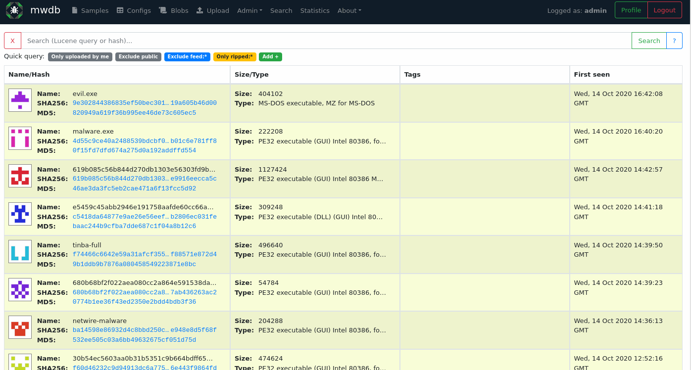

mwdb-plugin-drakvuf
===================

[DRAKVUF Sandbox](https://github.com/CERT-Polska/drakvuf-sandbox) simple integration plugin for [mwdb-core](https://github.com/CERT-Polska/mwdb-core).

You can use this plugin as a template for own webhook integrations with other sandboxes!



Setup & configuration
---------------------

First of all, make sure that `mwdb-core` is installed and configured correctly.

Plugin can be installed using pip:

```
$ pip install mwdb-plugin-drakvuf
```

Then edit `mwdb.ini` file to activate and configure the plugin.

```diff
- # plugins =
+ plugins = mwdb_plugin_drakvuf

  ...

+ [drakvuf]
+ drakvuf_url = http://localhost:6300
```

If you have more plugins activated, just add `mwdb_plugin_drakvuf` after comma.
 
`http://localhost:6300` used in example points at the DRAKVUF Sandbox web interface. 
Change it to the URL of your DRAKVUF instance according to your setup.

Run `mwdb-core configure` to apply changes required by plugin:

```
$ mwdb-core configure
INFO  [mwdb.configure] Configuration already initialized... skipping
INFO  [mwdb.application] Loaded plugin 'mwdb_plugin_drakvuf'
INFO  [alembic.runtime.migration] Context impl PostgresqlImpl.
INFO  [alembic.runtime.migration] Will assume transactional DDL.
INFO  [mwdb.configure] Database already initialized... skipping
INFO  [mwdb.plugin.drakvuf] Configuring 'drakvuf' attribute key.
INFO  [mwdb.application] Configured plugin 'mwdb_plugin_drakvuf'

MWDB configured successfully!

Use 'mwdb-core run' to run the server.

```

Run `mwdb-core run` to start the MWDB and test the integration.

## Contact

If you have any problems, bugs or feature requests related to MWDB or this plugin, you're encouraged to create a GitHub issue. If you want to contact the current maintainers directly, you can email:

- Paweł Srokosz (psrok1@cert.pl)
- Jarosław Jedynak (msm@cert.pl)
- CERT.PL (info@cert.pl)